# Plan de Integración: Google OAuth para Sitios Web en Vercel con Data2Rest

## 📋 Resumen Ejecutivo

Este documento describe el plan completo para implementar autenticación con Google OAuth en sitios web alojados en Vercel que consumen datos de **data2rest**. El sistema permitirá que cada sitio web tenga secciones protegidas accesibles solo para usuarios autorizados, verificados a través de data2rest.

---

## 🎯 Objetivo

Permitir que sitios web en Vercel (cada uno con su propio dominio) implementen autenticación con Google, donde:

1. El usuario hace clic en un botón "Iniciar sesión con Google"
2. Se redirige a la ventana de autorización de Google
3. Google envía el código de acceso
4. **data2rest** verifica el código y valida que el usuario tenga acceso al sitio específico
5. Si el `user_id` + `site_id` coinciden, se permite el acceso a páginas restringidas

---

## 🏗️ Arquitectura de la Solución

```mermaid
sequenceDiagram
    participant Usuario
    participant SitioVercel as Sitio Web (Vercel)
    participant Google
    participant Data2Rest
    participant Database as BD Data2Rest

    Usuario->>SitioVercel: 1. Clic en "Login con Google"
    SitioVercel->>Google: 2. Redirige a OAuth (con site_id en state)
    Google->>Usuario: 3. Solicita autorización
    Usuario->>Google: 4. Autoriza
    Google->>SitioVercel: 5. Redirige con código de autorización
    SitioVercel->>Data2Rest: 6. POST /api/v1/auth/google/verify
    Data2Rest->>Google: 7. Valida código y obtiene info usuario
    Data2Rest->>Database: 8. Verifica user_id + site_id
    Database-->>Data2Rest: 9. Retorna permisos
    Data2Rest-->>SitioVercel: 10. Retorna JWT token + datos usuario
    SitioVercel->>Usuario: 11. Almacena token y permite acceso
```



---

## 📦 Componentes del Sistema

### 1. **En Data2Rest (Backend)**
- Nuevo endpoint API para verificación de Google OAuth
- Tabla de sitios registrados
- Tabla de permisos usuario-sitio
- Sistema de tokens JWT para sesiones
- Validación de códigos de Google

### 2. **En Sitios Web Vercel (Frontend)**
- Botón de login con Google
- Manejo de callback de Google
- Almacenamiento de token JWT
- Middleware para proteger rutas
- Verificación de sesión

---

## 🔧 PARTE 1: Implementación en Data2Rest

> [!NOTE]
> **Aprovechando la Infraestructura Existente**
> 
> Data2rest ya cuenta con un sistema robusto de **proyectos** (`projects` y `project_users`). En lugar de crear tablas nuevas, vamos a **extender las tablas existentes** para soportar autenticación externa con Google OAuth. Cada proyecto puede representar uno o más sitios web.

### 1.1. Estructura de Base de Datos

#### ✅ Tablas Existentes (Ya en Data2Rest)

**Tabla `projects`** - Ya existe, solo necesita columnas adicionales:
```sql
-- Estructura actual (simplificada):
CREATE TABLE projects (
    id INTEGER PRIMARY KEY AUTOINCREMENT,
    name TEXT UNIQUE NOT NULL,
    description TEXT,
    status TEXT DEFAULT 'active',
    client_id INTEGER,
    created_at DATETIME DEFAULT CURRENT_TIMESTAMP,
    updated_at DATETIME DEFAULT CURRENT_TIMESTAMP
    -- ... otras columnas de billing
);
```

**Tabla `project_users`** - Ya existe, relaciona usuarios con proyectos:
```sql
-- Estructura actual:
CREATE TABLE project_users (
    project_id INTEGER,
    user_id INTEGER,
    permissions TEXT,  -- JSON con permisos
    assigned_at DATETIME DEFAULT CURRENT_TIMESTAMP,
    PRIMARY KEY (project_id, user_id),
    FOREIGN KEY (project_id) REFERENCES projects(id),
    FOREIGN KEY (user_id) REFERENCES users(id)
);
```

**Tabla `users`** - Ya existe, solo necesita asegurar columna `google_id`:
```sql
-- Ya tiene google_id agregado automáticamente por GoogleAuthController
ALTER TABLE users ADD COLUMN google_id TEXT;
```

---

#### 🆕 Nuevas Columnas en Tablas Existentes

**Extender tabla `projects`:**
```sql
-- Agregar configuración de Google OAuth por proyecto
ALTER TABLE projects ADD COLUMN google_client_id VARCHAR(255);
ALTER TABLE projects ADD COLUMN google_client_secret VARCHAR(255);
ALTER TABLE projects ADD COLUMN domain VARCHAR(255);
ALTER TABLE projects ADD COLUMN allowed_origins TEXT; -- JSON array
ALTER TABLE projects ADD COLUMN external_auth_enabled INTEGER DEFAULT 0;
```

**Ejemplo de proyecto configurado:**
```json
{
    "id": 1,
    "name": "Mi Sitio Web",
    "domain": "misitio.com",
    "google_client_id": "tu-client-id.apps.googleusercontent.com",
    "google_client_secret": "tu-client-secret",
    "allowed_origins": "[\"https://misitio.com\", \"https://www.misitio.com\"]",
    "external_auth_enabled": 1,
    "status": "active"
}
```

**Extender tabla `project_users`:**
```sql
-- Agregar información específica de autenticación externa
ALTER TABLE project_users ADD COLUMN external_permissions TEXT; -- JSON específico para sitio web
ALTER TABLE project_users ADD COLUMN external_access_enabled INTEGER DEFAULT 1;
```

**Ejemplo de permisos en `project_users`:**
```json
{
    "project_id": 1,
    "user_id": 5,
    "permissions": "{\"admin\": true}",  -- Permisos internos de data2rest
    "external_permissions": "{\"pages\": [\"dashboard\", \"profile\", \"reports\"]}", -- Permisos del sitio web
    "external_access_enabled": 1
}
```

---

#### 🆕 Nueva Tabla: `project_sessions`
Almacena tokens de sesión activos.

```sql
CREATE TABLE site_sessions (
    id INTEGER PRIMARY KEY AUTOINCREMENT,
    site_id INTEGER NOT NULL,
    user_id INTEGER NOT NULL,
    token VARCHAR(512) NOT NULL UNIQUE,
    expires_at DATETIME NOT NULL,
    ip_address VARCHAR(45),
    user_agent TEXT,
    created_at DATETIME DEFAULT CURRENT_TIMESTAMP,
    FOREIGN KEY (site_id) REFERENCES sites(id) ON DELETE CASCADE,
    FOREIGN KEY (user_id) REFERENCES users(id) ON DELETE CASCADE
);
```

---

### 1.2. Nuevos Endpoints API

#### **Endpoint 1: Verificar Código de Google**

**Ruta:** `POST /api/v1/auth/google/verify`

**Headers:**
```
Content-Type: application/json
X-Project-ID: {project_id}
```

**Body:**
```json
{
    "code": "4/0AfJohXk...",
    "redirect_uri": "https://misitio.com/auth/callback"
}
```

**Respuesta Exitosa (200):**
```json
{
    "success": true,
    "data": {
        "token": "eyJhbGciOiJIUzI1NiIsInR5cCI6IkpXVCJ9...",
        "user": {
            "id": 5,
            "email": "usuario@gmail.com",
            "name": "Juan Pérez",
            "permissions": {
                "pages": ["dashboard", "profile", "reports"]
            }
        },
        "project": {
            "id": 1,
            "name": "Mi Sitio Web"
        },
        "expires_at": "2026-01-25T22:00:00Z"
    }
}
```

**Respuesta Error (403):**
```json
{
    "success": false,
    "error": "Usuario no autorizado para este proyecto"
}
```

---

#### **Endpoint 2: Validar Token de Sesión**

**Ruta:** `POST /api/v1/auth/verify-token`

**Headers:**
```
Content-Type: application/json
X-Project-ID: {project_id}
Authorization: Bearer {token}
```

**Respuesta Exitosa (200):**
```json
{
    "success": true,
    "data": {
        "user_id": 5,
        "email": "usuario@gmail.com",
        "project_id": 1,
        "permissions": {
            "pages": ["dashboard", "profile", "reports"]
        },
        "expires_at": "2026-01-25T22:00:00Z"
    }
}
```

---

#### **Endpoint 3: Cerrar Sesión**

**Ruta:** `POST /api/v1/auth/logout`

**Headers:**
```
Authorization: Bearer {token}
X-Project-ID: {project_id}
```

**Respuesta:**
```json
{
    "success": true,
    "message": "Sesión cerrada exitosamente"
}
```

---

#### **Endpoint 4: Configurar Proyecto para Auth Externa (Admin)**

**Ruta:** `PUT /api/v1/admin/projects/{project_id}/external-auth`

**Headers:**
```
Content-Type: application/json
X-API-KEY: {admin_api_key}
```

**Body:**
```json
{
    "domain": "misitio.com",
    "google_client_id": "...",
    "google_client_secret": "...",
    "allowed_origins": ["https://misitio.com", "https://www.misitio.com"],
    "external_auth_enabled": true
}
```

---

#### **Endpoint 5: Asignar Usuario a Proyecto con Permisos Externos (Admin)**

**Ruta:** `POST /api/v1/admin/projects/{project_id}/users`

**Body:**
```json
{
    "user_id": 5,
    "external_permissions": {
        "pages": ["dashboard", "profile"]
    },
    "external_access_enabled": true
}
```

---

#### **Endpoint 6: Registrar Actividad desde Sitio Externo**

**Ruta:** `POST /api/v1/external/{project_id}/log-activity`

**Headers:**
```
Content-Type: application/json
Authorization: Bearer {token}
X-Project-ID: {project_id}
```

**Body:**
```json
{
    "action": "record_updated",
    "resource": "pets",
    "resource_id": 10,
    "details": {
        "field": "name",
        "old_value": "Firulais",
        "new_value": "Firulais Jr."
    }
}
```

**Respuesta:**
```json
{
    "success": true,
    "message": "Actividad registrada"
}
```

**Tipos de acciones soportadas:**
- `external_login_success` / `external_login_failed`
- `external_logout`
- `record_created` / `record_updated` / `record_deleted`
- `record_viewed` (opcional)

---

### 1.3. Nuevo Controlador: `ProjectAuthController.php`


**Ubicación:** `src/Modules/Auth/ProjectAuthController.php`

**Responsabilidades:**
- Verificar códigos de Google OAuth para proyectos
- Generar tokens JWT
- Validar tokens de sesión
- Gestionar permisos usuario-proyecto para acceso externo
- Limpiar sesiones expiradas
- Aprovechar métodos existentes de `Auth::loadUserProjects()`

**Métodos principales:**
```php
class ProjectAuthController extends BaseController
{
    // Verifica código de Google y crea sesión externa
    public function verifyGoogleCode()
    
    // Valida un token JWT existente
    public function verifyToken()
    
    // Cierra sesión y elimina token
    public function logout()
    
    // Verifica si usuario tiene acceso externo a un proyecto
    private function hasExternalAccessToProject($userId, $projectId)
    
    // Genera token JWT
    private function generateJWT($userId, $projectId, $permissions)
    
    // Valida token JWT
    private function validateJWT($token, $projectId)
    
    // Obtiene configuración OAuth del proyecto
    private function getProjectOAuthConfig($projectId)
    
    // Registra actividad desde sitio externo
    public function logExternalActivity()
}
```

---

### 1.4. Clase Helper: `ActivityLogger`

**Ubicación:** `src/Core/ActivityLogger.php`

**Responsabilidades:**
- Registrar actividades de autenticación
- Registrar actividades CRUD desde sitios externos
- Facilitar logging consistente en todo el sistema

**Métodos principales:**
```php
class ActivityLogger
{
    // Log de actividad externa (CRUD)
    public static function logExternal($userId, $projectId, $action, $resource, $resourceId, $details = [])
    
    // Log de autenticación
    public static function logAuth($userId, $projectId, $action, $success, $reason = null)
}
```

---

### 1.5. Sistema de Tokens JWT

**Librería recomendada:** `firebase/php-jwt`

**Instalación:**
```bash
cd /opt/homebrew/var/www/data2rest
composer require firebase/php-jwt
```

**Estructura del Token:**
```json
{
    "iss": "data2rest",
    "sub": "5",
    "project_id": "1",
    "email": "usuario@gmail.com",
    "permissions": {
        "pages": ["dashboard", "profile"]
    },
    "iat": 1706140800,
    "exp": 1706227200
}
```

**Secret Key:** Almacenar en `system_settings` con clave `jwt_secret`

---

### 1.5. Configuración de Google OAuth

**En `system_settings` agregar:**

```sql
INSERT INTO system_settings (key_name, value, description) VALUES
('google_oauth_enabled', '1', 'Habilitar autenticación Google para sitios externos'),
('jwt_secret', 'generar-clave-aleatoria-segura', 'Clave secreta para firmar tokens JWT'),
('jwt_expiration', '86400', 'Tiempo de expiración de tokens en segundos (24h)');
```

---

### 1.6. Panel de Administración

**Extender sección existente:** "Proyectos" → Nueva pestaña "Autenticación Externa"

**Funcionalidades:**
1. **Configurar proyecto para auth externa**
   - En la edición de proyecto, nueva sección "Google OAuth"
   - Campos: Dominio, Client ID, Client Secret, Orígenes permitidos
   - Toggle: Habilitar/Deshabilitar autenticación externa
   
2. **Gestionar usuarios del proyecto**
   - Extender vista existente de `project_users`
   - Nueva columna: "Acceso Externo" (toggle)
   - Botón "Configurar Permisos Web" → Modal con permisos específicos
   - Ejemplo: Checkboxes para páginas permitidas
   
3. **Logs de autenticación externa**
   - Nueva vista en "Proyectos" → "Logs de Actividad"
   - Filtrar por: Usuario, Acción, Fecha, Recurso
   - Mostrar: Usuario, Fecha/Hora, Acción, Detalles, IP
   - Exportar a CSV/JSON
   - Dashboard con métricas: Total logins, Usuarios activos, Tasa de éxito
   - Gráficos de actividad por tipo

4. **Sesiones activas**
   - Ver tokens activos por proyecto
   - Opción de revocar sesiones
   - Información: Usuario, IP, Fecha de creación, Última actividad

---

### 1.7. Nuevo Controlador: `ProjectLogsController.php`

**Ubicación:** `src/Modules/Projects/ProjectLogsController.php`

**Responsabilidades:**
- Mostrar logs de actividad del proyecto
- Filtrar logs por usuario, acción, fecha, recurso
- Exportar logs a CSV/JSON
- Generar métricas y dashboard de actividad

**Métodos principales:**
```php
class ProjectLogsController extends BaseController
{
    // Vista principal de logs
    public function index($projectId)
    
    // Exportar logs a CSV
    public function exportCsv($projectId)
    
    // Exportar logs a JSON
    public function exportJson($projectId)
    
    // Dashboard de métricas
    public function metrics($projectId)
}
```

---

### 1.8. Seguridad en Data2Rest

> [!IMPORTANT]
> **Medidas de seguridad críticas:**

1. **CORS (Cross-Origin Resource Sharing)**
   - Validar que las peticiones vengan solo de dominios registrados en `allowed_origins`
   - Implementar en `SiteAuthController`

2. **Rate Limiting**
   - Limitar intentos de verificación por IP (máx 10/minuto)
   - Usar `RateLimiter` existente

3. **Validación de Tokens**
   - Verificar firma JWT
   - Comprobar expiración
   - Validar que `project_id` coincida
   - Verificar que `external_auth_enabled = 1` en el proyecto

4. **Logs de Auditoría**
   - Registrar todos los intentos de autenticación
   - Alertas de actividad sospechosa

5. **HTTPS Obligatorio**
   - Rechazar peticiones HTTP en producción

---

## 🌐 PARTE 2: Implementación en Sitios Web (Vercel)

### 2.1. Configuración Inicial

#### Paso 1: Configurar Proyecto en Data2Rest

1. Acceder al panel de administración de data2rest
2. Ir a "Proyectos" → Seleccionar o crear proyecto
3. En la pestaña "Autenticación Externa":
   - **Dominio:** misitio.com
   - **Google Client ID:** (de Google Cloud Console)
   - **Google Client Secret:** (de Google Cloud Console)
   - **Orígenes permitidos:** `["https://misitio.com", "https://www.misitio.com"]`
   - **Habilitar autenticación externa:** ✓
4. Guardar configuración
5. Ir a "Usuarios del Proyecto"
6. Para cada usuario que debe tener acceso al sitio web:
   - Activar "Acceso Externo"
   - Clic en "Configurar Permisos Web"
   - Seleccionar páginas permitidas: dashboard, profile, reports
   - Guardar

#### Paso 2: Configurar Google Cloud Console

1. Ir a [Google Cloud Console](https://console.cloud.google.com)
2. Crear un nuevo proyecto o seleccionar uno existente
3. Habilitar "Google+ API"
4. Crear credenciales OAuth 2.0:
   - **Tipo:** Aplicación web
   - **Orígenes autorizados:** `https://misitio.com`
   - **URIs de redirección:** `https://misitio.com/auth/callback`
5. Copiar Client ID y Client Secret (usar en Paso 1)

#### Paso 3: Variables de Entorno en Vercel

Crear archivo `.env.local`:

```bash
NEXT_PUBLIC_DATA2REST_URL=https://tu-data2rest.com
NEXT_PUBLIC_PROJECT_ID=1
NEXT_PUBLIC_GOOGLE_CLIENT_ID=tu-client-id.apps.googleusercontent.com
DATA2REST_API_KEY=tu-api-key-de-data2rest
```

**Configurar en Vercel:**
1. Ir a Project Settings → Environment Variables
2. Agregar cada variable
3. Redeploy el proyecto

---

### 2.2. Estructura de Archivos (Next.js)

```
mi-sitio-vercel/
├── app/
│   ├── auth/
│   │   ├── callback/
│   │   │   └── page.tsx          # Maneja callback de Google
│   │   └── login/
│   │       └── page.tsx          # Página de login
│   ├── dashboard/
│   │   └── page.tsx              # Página protegida
│   └── api/
│       └── auth/
│           ├── verify.ts         # Verifica código con data2rest
│           └── session.ts        # Valida sesión actual
├── lib/
│   ├── auth.ts                   # Funciones de autenticación
│   └── data2rest.ts              # Cliente API data2rest
├── middleware.ts                 # Protege rutas
└── components/
    └── GoogleLoginButton.tsx     # Botón de login
```

---

### 2.3. Componente: Botón de Login con Google

**Archivo:** `components/GoogleLoginButton.tsx`

```tsx
'use client';

import { useEffect } from 'react';

export default function GoogleLoginButton() {
  const handleLogin = () => {
    const clientId = process.env.NEXT_PUBLIC_GOOGLE_CLIENT_ID;
    const redirectUri = `${window.location.origin}/auth/callback`;
    const projectId = process.env.NEXT_PUBLIC_PROJECT_ID;
    
    const params = new URLSearchParams({
      client_id: clientId!,
      redirect_uri: redirectUri,
      response_type: 'code',
      scope: 'email profile',
      state: projectId!, // Incluir project_id en state
      access_type: 'offline',
      prompt: 'consent'
    });

    window.location.href = `https://accounts.google.com/o/oauth2/v2/auth?${params}`;
  };

  return (
    <button
      onClick={handleLogin}
      className="flex items-center gap-3 bg-white border border-gray-300 rounded-lg px-6 py-3 hover:bg-gray-50 transition"
    >
      <svg className="w-5 h-5" viewBox="0 0 24 24">
        {/* SVG del logo de Google */}
      </svg>
      <span className="font-medium text-gray-700">
        Continuar con Google
      </span>
    </button>
  );
}
```

---

### 2.4. Página: Callback de Google

**Archivo:** `app/auth/callback/page.tsx`

```tsx
'use client';

import { useEffect, useState } from 'react';
import { useRouter, useSearchParams } from 'next/navigation';

export default function AuthCallback() {
  const router = useRouter();
  const searchParams = useSearchParams();
  const [error, setError] = useState<string | null>(null);

  useEffect(() => {
    const code = searchParams.get('code');
    const state = searchParams.get('state'); // project_id
    
    if (!code) {
      setError('No se recibió código de autorización');
      return;
    }

    // Verificar código con data2rest
    verifyWithData2Rest(code, state);
  }, [searchParams]);

  const verifyWithData2Rest = async (code: string, projectId: string | null) => {
    try {
      const response = await fetch('/api/auth/verify', {
        method: 'POST',
        headers: {
          'Content-Type': 'application/json',
        },
        body: JSON.stringify({
          code,
          redirect_uri: `${window.location.origin}/auth/callback`,
          project_id: projectId || process.env.NEXT_PUBLIC_PROJECT_ID
        })
      });

      const data = await response.json();

      if (data.success) {
        // Almacenar token en localStorage o cookie
        localStorage.setItem('auth_token', data.data.token);
        localStorage.setItem('user', JSON.stringify(data.data.user));
        
        // Redirigir a dashboard
        router.push('/dashboard');
      } else {
        setError(data.error || 'Error de autenticación');
      }
    } catch (err) {
      setError('Error al conectar con el servidor');
    }
  };

  if (error) {
    return (
      <div className="min-h-screen flex items-center justify-center">
        <div className="bg-red-50 border border-red-200 rounded-lg p-6">
          <h2 className="text-red-800 font-semibold mb-2">Error de Autenticación</h2>
          <p className="text-red-600">{error}</p>
          <button
            onClick={() => router.push('/auth/login')}
            className="mt-4 bg-red-600 text-white px-4 py-2 rounded hover:bg-red-700"
          >
            Volver a intentar
          </button>
        </div>
      </div>
    );
  }

  return (
    <div className="min-h-screen flex items-center justify-center">
      <div className="text-center">
        <div className="animate-spin rounded-full h-12 w-12 border-b-2 border-blue-600 mx-auto mb-4"></div>
        <p className="text-gray-600">Verificando credenciales...</p>
      </div>
    </div>
  );
}
```

---

### 2.5. API Route: Verificar Código

**Archivo:** `app/api/auth/verify/route.ts`

```typescript
import { NextRequest, NextResponse } from 'next/server';

export async function POST(request: NextRequest) {
  try {
    const { code, redirect_uri, project_id } = await request.json();

    // Llamar a data2rest para verificar
    const response = await fetch(
      `${process.env.NEXT_PUBLIC_DATA2REST_URL}/api/v1/auth/google/verify`,
      {
        method: 'POST',
        headers: {
          'Content-Type': 'application/json',
          'X-Project-ID': project_id || process.env.NEXT_PUBLIC_PROJECT_ID!,
        },
        body: JSON.stringify({
          code,
          redirect_uri
        })
      }
    );

    const data = await response.json();

    return NextResponse.json(data, { status: response.status });
  } catch (error) {
    return NextResponse.json(
      { success: false, error: 'Error interno del servidor' },
      { status: 500 }
    );
  }
}
```

---

### 2.6. Middleware: Proteger Rutas

**Archivo:** `middleware.ts`

```typescript
import { NextResponse } from 'next/server';
import type { NextRequest } from 'next/server';

export async function middleware(request: NextRequest) {
  const token = request.cookies.get('auth_token')?.value;

  // Rutas protegidas
  const protectedPaths = ['/dashboard', '/profile', '/reports'];
  const isProtectedPath = protectedPaths.some(path => 
    request.nextUrl.pathname.startsWith(path)
  );

  if (isProtectedPath && !token) {
    return NextResponse.redirect(new URL('/auth/login', request.url));
  }

  if (token && isProtectedPath) {
    // Verificar token con data2rest
    try {
      const response = await fetch(
        `${process.env.NEXT_PUBLIC_DATA2REST_URL}/api/v1/auth/verify-token`,
        {
          method: 'POST',
          headers: {
            'Authorization': `Bearer ${token}`,
            'X-Project-ID': process.env.NEXT_PUBLIC_PROJECT_ID!,
          }
        }
      );

      if (!response.ok) {
        // Token inválido, redirigir a login
        const response = NextResponse.redirect(new URL('/auth/login', request.url));
        response.cookies.delete('auth_token');
        return response;
      }

      const data = await response.json();
      
      // Verificar permisos para la página específica
      const page = request.nextUrl.pathname.split('/')[1];
      if (!data.data.permissions.pages.includes(page)) {
        return NextResponse.redirect(new URL('/unauthorized', request.url));
      }

    } catch (error) {
      return NextResponse.redirect(new URL('/auth/login', request.url));
    }
  }

  return NextResponse.next();
}

export const config = {
  matcher: ['/dashboard/:path*', '/profile/:path*', '/reports/:path*']
};
```

---

### 2.7. Hook Personalizado: useAuth

**Archivo:** `lib/auth.ts`

```typescript
import { useState, useEffect } from 'react';

interface User {
  id: number;
  email: string;
  name: string;
  permissions: {
    pages: string[];
  };
}

export function useAuth() {
  const [user, setUser] = useState<User | null>(null);
  const [loading, setLoading] = useState(true);

  useEffect(() => {
    const token = localStorage.getItem('auth_token');
    const userData = localStorage.getItem('user');

    if (token && userData) {
      setUser(JSON.parse(userData));
    }
    setLoading(false);
  }, []);

  const logout = async () => {
    const token = localStorage.getItem('auth_token');
    
    try {
      await fetch('/api/auth/logout', {
        method: 'POST',
        headers: {
          'Authorization': `Bearer ${token}`
        }
      });
    } catch (error) {
      console.error('Error al cerrar sesión:', error);
    }

    localStorage.removeItem('auth_token');
    localStorage.removeItem('user');
    setUser(null);
    window.location.href = '/auth/login';
  };

  const hasPermission = (page: string): boolean => {
    return user?.permissions.pages.includes(page) || false;
  };

  return { user, loading, logout };
}
```

---

### 2.8. Cliente API con Logging Automático

**Archivo:** `lib/api-client.ts`

```typescript
export class ApiClient {
  private baseUrl: string;
  private projectId: string;
  private token: string | null;

  constructor() {
    this.baseUrl = process.env.NEXT_PUBLIC_DATA2REST_URL!;
    this.projectId = process.env.NEXT_PUBLIC_PROJECT_ID!;
    this.token = localStorage.getItem('auth_token');
  }

  async get<T>(table: string, filters?: Record<string, any>): Promise<T> {
    const params = new URLSearchParams(filters);
    
    const response = await fetch(
      `${this.baseUrl}/api/v1/external/${this.projectId}/${table}?${params}`,
      {
        headers: {
          'Authorization': `Bearer ${this.token}`,
          'X-Project-ID': this.projectId
        }
      }
    );

    if (!response.ok) throw new Error('Error al obtener datos');
    const data = await response.json();
    return data.data;
  }

  async create<T>(table: string, data: any): Promise<T> {
    const response = await fetch(
      `${this.baseUrl}/api/v1/external/${this.projectId}/${table}`,
      {
        method: 'POST',
        headers: {
          'Authorization': `Bearer ${this.token}`,
          'X-Project-ID': this.projectId,
          'Content-Type': 'application/json'
        },
        body: JSON.stringify(data)
      }
    );

    if (!response.ok) throw new Error('Error al crear');
    const result = await response.json();

    // Registrar actividad automáticamente
    await this.logActivity('record_created', table, result.data.id, data);

    return result.data;
  }

  async update<T>(table: string, id: number, data: any, oldData?: any): Promise<T> {
    const response = await fetch(
      `${this.baseUrl}/api/v1/external/${this.projectId}/${table}/${id}`,
      {
        method: 'PUT',
        headers: {
          'Authorization': `Bearer ${this.token}`,
          'X-Project-ID': this.projectId,
          'Content-Type': 'application/json'
        },
        body: JSON.stringify(data)
      }
    );

    if (!response.ok) throw new Error('Error al actualizar');
    const result = await response.json();

    // Registrar actividad con cambios
    await this.logActivity('record_updated', table, id, {
      changes: this.getChanges(oldData, data)
    });

    return result.data;
  }

  async delete(table: string, id: number): Promise<void> {
    const response = await fetch(
      `${this.baseUrl}/api/v1/external/${this.projectId}/${table}/${id}`,
      {
        method: 'DELETE',
        headers: {
          'Authorization': `Bearer ${this.token}`,
          'X-Project-ID': this.projectId
        }
      }
    );

    if (!response.ok) throw new Error('Error al eliminar');

    // Registrar actividad
    await this.logActivity('record_deleted', table, id, {});
  }

  private async logActivity(action: string, resource: string, resourceId: number, details: any) {
    try {
      await fetch(
        `${this.baseUrl}/api/v1/external/${this.projectId}/log-activity`,
        {
          method: 'POST',
          headers: {
            'Authorization': `Bearer ${this.token}`,
            'X-Project-ID': this.projectId,
            'Content-Type': 'application/json'
          },
          body: JSON.stringify({
            action,
            resource,
            resource_id: resourceId,
            details
          })
        }
      );
    } catch (error) {
      // No fallar si el log falla
      console.error('Error logging activity:', error);
    }
  }

  private getChanges(oldData: any, newData: any): any[] {
    if (!oldData) return [];
    
    const changes = [];
    for (const key in newData) {
      if (oldData[key] !== newData[key]) {
        changes.push({
          field: key,
          old_value: oldData[key],
          new_value: newData[key]
        });
      }
    }
    return changes;
  }
}
```

**Uso en componentes:**

```tsx
const api = new ApiClient();

// Crear mascota - logging automático
await api.create('pets', {
  name: 'Firulais',
  species: 'dog'
});

// Editar mascota - logging automático con cambios
await api.update('pets', 10, {
  name: 'Firulais Jr.',
  age: 3
}, {
  name: 'Firulais',
  age: 2
});

// Eliminar mascota - logging automático
await api.delete('pets', 10);
```

---

### 2.8. Ejemplo de Página Protegida

**Archivo:** `app/dashboard/page.tsx`

```tsx
'use client';

import { useAuth } from '@/lib/auth';
import { useRouter } from 'next/navigation';
import { useEffect } from 'react';

export default function Dashboard() {
  const { user, loading, logout, hasPermission } = useAuth();
  const router = useRouter();

  useEffect(() => {
    if (!loading && !user) {
      router.push('/auth/login');
    }
  }, [user, loading, router]);

  if (loading) {
    return <div>Cargando...</div>;
  }

  if (!user) {
    return null;
  }

  return (
    <div className="min-h-screen bg-gray-50">
      <nav className="bg-white shadow">
        <div className="max-w-7xl mx-auto px-4 py-4 flex justify-between items-center">
          <h1 className="text-xl font-bold">Dashboard</h1>
          <div className="flex items-center gap-4">
            <span className="text-gray-600">{user.email}</span>
            <button
              onClick={logout}
              className="bg-red-600 text-white px-4 py-2 rounded hover:bg-red-700"
            >
              Cerrar Sesión
            </button>
          </div>
        </div>
      </nav>

      <main className="max-w-7xl mx-auto px-4 py-8">
        <h2 className="text-2xl font-bold mb-6">Bienvenido, {user.name}</h2>
        
        <div className="grid grid-cols-1 md:grid-cols-3 gap-6">
          {hasPermission('dashboard') && (
            <div className="bg-white p-6 rounded-lg shadow">
              <h3 className="font-semibold mb-2">Dashboard</h3>
              <p className="text-gray-600">Contenido del dashboard</p>
            </div>
          )}

          {hasPermission('profile') && (
            <div className="bg-white p-6 rounded-lg shadow">
              <h3 className="font-semibold mb-2">Perfil</h3>
              <p className="text-gray-600">Gestiona tu perfil</p>
            </div>
          )}

          {hasPermission('reports') && (
            <div className="bg-white p-6 rounded-lg shadow">
              <h3 className="font-semibold mb-2">Reportes</h3>
              <p className="text-gray-600">Ver reportes</p>
            </div>
          )}
        </div>
      </main>
    </div>
  );
}
```

---

## 🔄 Flujo Completo de Autenticación

### Paso a Paso

1. **Usuario visita sitio web**
   - Accede a `https://misitio.com/auth/login`
   - Ve botón "Continuar con Google"

2. **Clic en botón de Google**
   - JavaScript redirige a Google OAuth
   - URL incluye `client_id`, `redirect_uri`, `state` (site_id)

3. **Autorización en Google**
   - Usuario selecciona cuenta
   - Acepta permisos solicitados
   - Google redirige a `https://misitio.com/auth/callback?code=...`

4. **Callback procesa código**
   - Página extrae `code` de URL
   - Llama a `/api/auth/verify` (API route del sitio)

5. **API Route contacta Data2Rest**
   - POST a `https://data2rest.com/api/v1/auth/google/verify`
   - Envía: `code`, `redirect_uri`, headers con `X-Site-ID`

6. **Data2Rest verifica con Google**
   - Usa `google_client_secret` del sitio
   - Intercambia código por access token
   - Obtiene email y google_id del usuario

7. **Data2Rest valida permisos**
   - Busca en `site_users` si existe registro con:
     - `site_id` = del header
     - `google_email` o `google_id` del usuario
   - Si no existe → Error 403
   - Si existe y `status=1` → Continúa

8. **Data2Rest genera JWT**
   - Crea token con: `user_id`, `site_id`, `permissions`, `exp`
   - Guarda en `site_sessions`
   - Retorna token + datos de usuario

9. **Sitio almacena sesión**
   - Guarda token en `localStorage` o cookie
   - Guarda datos de usuario
   - Redirige a `/dashboard`

10. **Acceso a páginas protegidas**
    - Middleware verifica token en cada request
    - Llama a `/api/v1/auth/verify-token` de data2rest
    - Si válido → Permite acceso
    - Si inválido → Redirige a login

---

## 📋 Checklist de Implementación

### En Data2Rest

- [ ] **Base de Datos**
  - [ ] Crear tabla `sites`
  - [ ] Crear tabla `site_users`
  - [ ] Crear tabla `site_sessions`
  - [ ] Agregar configuraciones en `system_settings`

- [ ] **Backend**
  - [ ] Instalar `firebase/php-jwt` con Composer
  - [ ] Crear `SiteAuthController.php`
  - [ ] Implementar método `verifyGoogleCode()`
  - [ ] Implementar método `verifyToken()`
  - [ ] Implementar método `logout()`
  - [ ] Agregar rutas en `Router.php`

- [ ] **Seguridad**
  - [ ] Implementar validación CORS
  - [ ] Configurar Rate Limiting
  - [ ] Agregar logs de auditoría
  - [ ] Validar HTTPS en producción

- [ ] **Panel Admin**
  - [ ] Crear vista de listado de sitios
  - [ ] Crear formulario de crear/editar sitio
  - [ ] Crear vista de asignación de usuarios
  - [ ] Crear vista de logs de autenticación

- [ ] **Testing**
  - [ ] Probar verificación de código
  - [ ] Probar validación de token
  - [ ] Probar expiración de sesiones
  - [ ] Probar permisos por sitio

---

### En Cada Sitio Web (Vercel)

- [ ] **Configuración Inicial**
  - [ ] Registrar sitio en data2rest
  - [ ] Crear proyecto en Google Cloud Console
  - [ ] Configurar OAuth 2.0
  - [ ] Agregar variables de entorno en Vercel

- [ ] **Código Frontend**
  - [ ] Crear `GoogleLoginButton.tsx`
  - [ ] Crear página `/auth/login`
  - [ ] Crear página `/auth/callback`
  - [ ] Crear API route `/api/auth/verify`
  - [ ] Crear API route `/api/auth/logout`
  - [ ] Implementar `middleware.ts`
  - [ ] Crear hook `useAuth()`

- [ ] **Páginas Protegidas**
  - [ ] Implementar protección en rutas
  - [ ] Agregar verificación de permisos
  - [ ] Manejar errores de autenticación

- [ ] **Testing**
  - [ ] Probar flujo completo de login
  - [ ] Probar acceso a páginas protegidas
  - [ ] Probar logout
  - [ ] Probar expiración de sesión

---

## 🚨 Consideraciones Importantes

### Seguridad

> [!CAUTION]
> **Puntos críticos de seguridad:**

1. **Nunca exponer Client Secret en frontend**
   - Solo usar en backend (data2rest)
   - No incluir en variables `NEXT_PUBLIC_*`

2. **Validar origen de peticiones**
   - Verificar `allowed_origins` en cada request
   - Implementar CORS estricto

3. **Tokens con expiración corta**
   - Máximo 24 horas
   - Implementar refresh tokens si es necesario

4. **HTTPS obligatorio**
   - Tanto en data2rest como en sitios
   - Rechazar conexiones HTTP

### Escalabilidad

- **Limpieza de sesiones expiradas**
  - Crear cron job que elimine tokens vencidos
  - Ejecutar diariamente

- **Cache de validaciones**
  - Cachear validaciones de token por 5 minutos
  - Reducir carga en base de datos

### Experiencia de Usuario

- **Manejo de errores**
  - Mensajes claros y en español
  - Opciones de reintento

- **Loading states**
  - Indicadores visuales durante verificación
  - Evitar pantallas en blanco

---

## 📊 Ejemplo de Caso de Uso

### Escenario: Blog con Área de Miembros

**Sitio:** `https://miblog.com`  
**Proyecto en Data2Rest:** ID 1 - "Mi Blog"

**Usuarios:**
- Juan (ID: 5) - Acceso a: dashboard, artículos, estadísticas
- María (ID: 8) - Acceso a: dashboard, artículos

**Configuración en Data2Rest:**

```sql
-- 1. Configurar proyecto para autenticación externa
UPDATE projects SET 
    domain = 'miblog.com',
    google_client_id = '123456.apps.googleusercontent.com',
    google_client_secret = 'secret123',
    allowed_origins = '["https://miblog.com", "https://www.miblog.com"]',
    external_auth_enabled = 1
WHERE id = 1;

-- 2. Asignar Juan al proyecto (si no existe)
INSERT OR IGNORE INTO project_users (project_id, user_id, permissions)
VALUES (1, 5, '{"admin": false}');

-- 3. Configurar permisos externos de Juan
UPDATE project_users SET
    external_permissions = '{"pages": ["dashboard", "artículos", "estadísticas"]}',
    external_access_enabled = 1
WHERE project_id = 1 AND user_id = 5;

-- 4. Asignar María al proyecto (si no existe)
INSERT OR IGNORE INTO project_users (project_id, user_id, permissions)
VALUES (1, 8, '{"admin": false}');

-- 5. Configurar permisos externos de María
UPDATE project_users SET
    external_permissions = '{"pages": ["dashboard", "artículos"]}',
    external_access_enabled = 1
WHERE project_id = 1 AND user_id = 8;
```

**Resultado:**
- Juan puede acceder a `/dashboard`, `/artículos`, `/estadísticas`
- María puede acceder a `/dashboard`, `/artículos` pero NO a `/estadísticas`
- Cualquier otro usuario de Google será rechazado

---

## 🔗 Recursos Adicionales

### Documentación

- [Google OAuth 2.0](https://developers.google.com/identity/protocols/oauth2)
- [JWT.io](https://jwt.io/)
- [Next.js Middleware](https://nextjs.org/docs/app/building-your-application/routing/middleware)
- [Vercel Environment Variables](https://vercel.com/docs/projects/environment-variables)

### Librerías Recomendadas

**Backend (Data2Rest):**
- `firebase/php-jwt` - Manejo de JWT

**Frontend (Next.js):**
- `js-cookie` - Manejo de cookies
- `@tanstack/react-query` - Cache de peticiones API

---

## 📞 Soporte

Para dudas o problemas durante la implementación:

1. Revisar logs en data2rest (`/admin/logs`)
2. Verificar configuración de Google Cloud Console
3. Comprobar variables de entorno en Vercel
4. Validar permisos en tabla `site_users`

---

## ✅ Próximos Pasos

1. **Revisar este plan** y confirmar que cumple con tus necesidades
2. **Priorizar implementación:**
   - Primero: Extender tablas en data2rest (migrations)
   - Segundo: Crear `ProjectAuthController` y endpoints
   - Tercero: Actualizar panel admin de proyectos
   - Cuarto: Implementar en un sitio de prueba
   - Quinto: Replicar en otros proyectos/sitios
3. **Definir permisos** específicos para cada proyecto
4. **Preparar credenciales** de Google OAuth

---

**Documento creado:** 2026-01-24  
**Versión:** 1.0  
**Autor:** Antigravity AI Assistant
