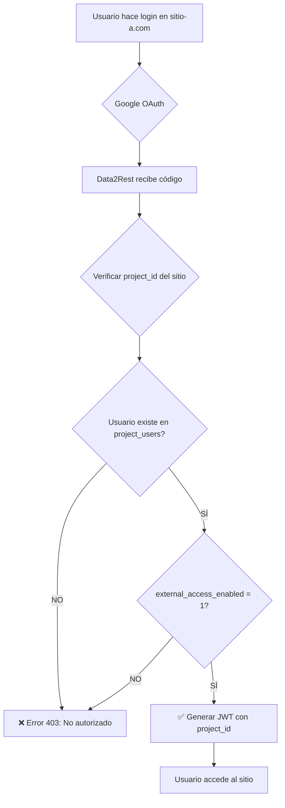

# 🔐 Seguridad y Casos de Uso - Google OAuth Multi-Proyecto

## ✅ Respuesta Rápida

**SÍ, funciona exactamente como lo describes:**

1. ✅ Un usuario puede autenticarse en **múltiples sitios web** usando Google
2. ✅ Solo puede acceder a sitios de **proyectos donde está asignado**
3. ✅ Si intenta acceder a un proyecto no asignado → **Acceso denegado**
4. ✅ El proceso es **transparente** para el usuario final
5. ✅ Un administrador puede gestionar **múltiples proyectos**
6. ✅ Cada proyecto tiene su **propia configuración OAuth**

---

## 🔒 Validaciones de Seguridad Implementadas

### 1. **Verificación en Cada Request**

Cuando un usuario intenta autenticarse en un sitio web:



### 2. **Validación Multi-Capa**

El sistema verifica **3 niveles de seguridad**:

#### **Nivel 1: Proyecto Activo**
```sql
-- Verificar que el proyecto existe y está activo
SELECT * FROM projects 
WHERE id = ? 
  AND status = 'active' 
  AND external_auth_enabled = 1
```

#### **Nivel 2: Usuario Asignado al Proyecto**
```sql
-- Verificar que el usuario está en el proyecto
SELECT * FROM project_users 
WHERE project_id = ? 
  AND user_id = ? 
  AND external_access_enabled = 1
```

#### **Nivel 3: Token JWT Válido**
```javascript
// El token JWT incluye el project_id
{
    "project_id": "1",
    "user_id": "5",
    "exp": 1706227200
}

// En cada request se valida:
// 1. Firma del token
// 2. No expirado
// 3. project_id coincide con el sitio
```

---

## 📋 Casos de Uso Detallados

### **Caso 1: Usuario con UN Solo Proyecto**

**Escenario:**
- María es cliente del Proyecto 1 (sitio-a.com)
- NO está asignada al Proyecto 2 (sitio-b.com)

**Flujo:**

```
1. María visita sitio-a.com → Login con Google
   ✅ Data2Rest verifica: María ∈ Proyecto 1
   ✅ Genera token con project_id=1
   ✅ María accede a sitio-a.com

2. María visita sitio-b.com → Login con Google
   ❌ Data2Rest verifica: María ∉ Proyecto 2
   ❌ Error: "Usuario no autorizado para este proyecto"
   ❌ María NO puede acceder
```

**Código de validación:**
```php
// En ProjectAuthController::verifyGoogleCode()

// 1. Obtener project_id del header
$projectId = $_SERVER['HTTP_X_PROJECT_ID'];

// 2. Verificar que usuario está en el proyecto
$stmt = $db->prepare("
    SELECT pu.*, p.external_auth_enabled 
    FROM project_users pu
    JOIN projects p ON pu.project_id = p.id
    WHERE pu.project_id = ? 
      AND pu.user_id = ?
      AND pu.external_access_enabled = 1
      AND p.external_auth_enabled = 1
      AND p.status = 'active'
");
$stmt->execute([$projectId, $userId]);
$access = $stmt->fetch();

if (!$access) {
    return $this->json([
        'success' => false,
        'error' => 'Usuario no autorizado para este proyecto'
    ], 403);
}
```

---

### **Caso 2: Administrador con MÚLTIPLES Proyectos**

**Escenario:**
- Juan es administrador
- Asignado a Proyecto 1 (sitio-a.com)
- Asignado a Proyecto 3 (sitio-c.com)
- NO asignado a Proyecto 2 (sitio-b.com)

**Flujo:**

```
1. Juan visita sitio-a.com
   ✅ Verificación: Juan ∈ Proyecto 1
   ✅ Token generado: {project_id: 1, user_id: 10}
   ✅ Acceso permitido a sitio-a.com

2. Juan visita sitio-c.com
   ✅ Verificación: Juan ∈ Proyecto 3
   ✅ Token generado: {project_id: 3, user_id: 10}
   ✅ Acceso permitido a sitio-c.com

3. Juan visita sitio-b.com
   ❌ Verificación: Juan ∉ Proyecto 2
   ❌ Acceso DENEGADO
```

**Importante:** Cada sitio genera su **propio token JWT** con el `project_id` correspondiente.

---

### **Caso 3: Intento de Suplantación de Proyecto**

**Escenario de Ataque:**
- Hacker obtiene token válido de sitio-a.com (project_id=1)
- Intenta usar ese token en sitio-b.com (project_id=2)

**Protección:**

```javascript
// En el middleware del sitio web (Vercel)
const response = await fetch(
    `${DATA2REST_URL}/api/v1/auth/verify-token`,
    {
        headers: {
            'Authorization': `Bearer ${token}`,
            'X-Project-ID': '2'  // sitio-b.com
        }
    }
);

// En Data2Rest - ProjectAuthController::verifyToken()
$payload = JWT::decode($token, $secret);

// Validación crítica
if ($payload->project_id !== $requestedProjectId) {
    return $this->json([
        'success' => false,
        'error' => 'Token no válido para este proyecto'
    ], 403);
}
```

**Resultado:** ❌ Ataque bloqueado

---

## 🎯 Flujo Completo con Validaciones

### **Autenticación Inicial**

```
┌─────────────────────────────────────────────────────────────┐
│ USUARIO visita sitio-a.com (Proyecto 1)                    │
└─────────────────────────────────────────────────────────────┘
                        ↓
┌─────────────────────────────────────────────────────────────┐
│ 1. Clic en "Login con Google"                               │
│    → Redirige a Google con state=project_id                 │
└─────────────────────────────────────────────────────────────┘
                        ↓
┌─────────────────────────────────────────────────────────────┐
│ 2. Google autentica y retorna código                        │
└─────────────────────────────────────────────────────────────┘
                        ↓
┌─────────────────────────────────────────────────────────────┐
│ 3. Sitio envía a Data2Rest:                                 │
│    POST /api/v1/auth/google/verify                          │
│    Headers: X-Project-ID: 1                                 │
│    Body: { code: "...", redirect_uri: "..." }               │
└─────────────────────────────────────────────────────────────┘
                        ↓
┌─────────────────────────────────────────────────────────────┐
│ 4. Data2Rest VALIDA:                                        │
│    ✓ Proyecto existe y está activo                          │
│    ✓ external_auth_enabled = 1                              │
│    ✓ Código de Google válido                                │
│    ✓ Obtiene email del usuario                              │
│    ✓ Usuario existe en users (por google_id o email)        │
│    ✓ Usuario está en project_users para project_id=1        │
│    ✓ external_access_enabled = 1                            │
└─────────────────────────────────────────────────────────────┘
                        ↓
         ┌──────────────┴──────────────┐
         │                             │
    ❌ FALLA                       ✅ ÉXITO
         │                             │
         ↓                             ↓
┌──────────────────┐      ┌────────────────────────┐
│ Error 403        │      │ Genera JWT:            │
│ "No autorizado"  │      │ {                      │
└──────────────────┘      │   project_id: 1,       │
                          │   user_id: 5,          │
                          │   permissions: {...}   │
                          │ }                      │
                          └────────────────────────┘
                                     ↓
                          ┌────────────────────────┐
                          │ Guarda en              │
                          │ project_sessions       │
                          └────────────────────────┘
                                     ↓
                          ┌────────────────────────┐
                          │ Retorna token al sitio │
                          └────────────────────────┘
                                     ↓
                          ┌────────────────────────┐
                          │ Usuario accede         │
                          │ a sitio-a.com          │
                          └────────────────────────┘
```

### **Validación en Cada Request**

```
┌─────────────────────────────────────────────────────────────┐
│ Usuario navega a página protegida en sitio-a.com            │
└─────────────────────────────────────────────────────────────┘
                        ↓
┌─────────────────────────────────────────────────────────────┐
│ Middleware verifica token:                                  │
│ POST /api/v1/auth/verify-token                              │
│ Headers:                                                     │
│   Authorization: Bearer eyJhbG...                            │
│   X-Project-ID: 1                                           │
└─────────────────────────────────────────────────────────────┘
                        ↓
┌─────────────────────────────────────────────────────────────┐
│ Data2Rest VALIDA:                                           │
│ ✓ Token no expirado                                         │
│ ✓ Firma válida                                              │
│ ✓ project_id en token = project_id en header               │
│ ✓ Sesión existe en project_sessions                        │
│ ✓ Usuario sigue activo en project_users                    │
└─────────────────────────────────────────────────────────────┘
                        ↓
         ┌──────────────┴──────────────┐
         │                             │
    ❌ FALLA                       ✅ ÉXITO
         │                             │
         ↓                             ↓
┌──────────────────┐      ┌────────────────────────┐
│ Redirige a login │      │ Permite acceso         │
└──────────────────┘      │ Retorna permisos       │
                          └────────────────────────┘
```

---

## 🔐 Tabla de Permisos - Ejemplo Real

### **Base de Datos:**

**Tabla `projects`:**
| id | name | domain | external_auth_enabled |
|----|------|--------|----------------------|
| 1 | Blog Personal | blog.com | 1 |
| 2 | E-commerce | tienda.com | 1 |
| 3 | Dashboard Interno | admin.empresa.com | 0 |

**Tabla `project_users`:**
| project_id | user_id | external_access_enabled | external_permissions |
|------------|---------|------------------------|---------------------|
| 1 | 5 (María) | 1 | `{"pages": ["dashboard"]}` |
| 2 | 5 (María) | 0 | `null` |
| 1 | 10 (Juan) | 1 | `{"pages": ["dashboard", "admin"]}` |
| 2 | 10 (Juan) | 1 | `{"pages": ["dashboard", "orders"]}` |
| 3 | 10 (Juan) | 1 | `{"pages": ["dashboard"]}` |

### **Matriz de Acceso:**

| Usuario | blog.com (P1) | tienda.com (P2) | admin.empresa.com (P3) |
|---------|---------------|-----------------|------------------------|
| **María (5)** | ✅ Acceso<br>Páginas: dashboard | ❌ Bloqueado<br>(external_access=0) | ❌ Bloqueado<br>(no asignada) |
| **Juan (10)** | ✅ Acceso<br>Páginas: dashboard, admin | ✅ Acceso<br>Páginas: dashboard, orders | ❌ Bloqueado<br>(external_auth_enabled=0) |

---

## 🛡️ Protecciones Adicionales

### 1. **Rate Limiting por IP**
```php
// Máximo 10 intentos de login por IP cada 15 minutos
if (RateLimiter::tooManyAttempts($ip, 10, 900)) {
    return $this->json(['error' => 'Demasiados intentos'], 429);
}
```

### 2. **CORS Estricto**
```php
// Solo permitir requests desde dominios registrados
$allowedOrigins = json_decode($project->allowed_origins);
if (!in_array($origin, $allowedOrigins)) {
    return $this->json(['error' => 'Origen no permitido'], 403);
}
```

### 3. **Logs de Auditoría**
```sql
-- Registrar cada intento de autenticación
INSERT INTO activity_logs (user_id, project_id, action, ip_address, details)
VALUES (?, ?, 'external_auth_attempt', ?, ?);
```

### 4. **Revocación de Tokens**
```php
// Administrador puede revocar sesiones activas
DELETE FROM project_sessions 
WHERE project_id = ? AND user_id = ?;
```

---

## ✅ Confirmación Final

### **Tu Caso de Uso:**

> "Un usuario puede tener más de un proyecto asociado, puede ser cliente o administrador, y puede acceder a más de un sitio web usando Google OAuth, siempre y cuando esté asociado al proyecto"

**Respuesta:** ✅ **SÍ, funciona perfectamente así**

### **Seguridad Garantizada:**

✅ Usuario **solo accede** a proyectos donde está asignado  
✅ Cada sitio **valida independientemente** el acceso  
✅ Tokens **no son intercambiables** entre proyectos  
✅ Proceso **transparente** para el usuario  
✅ Administradores pueden gestionar **múltiples proyectos**  

### **No Requiere Cambios:**

El plan actual ya contempla todos estos escenarios. La arquitectura está diseñada para:

1. **Múltiples proyectos por usuario** ✓
2. **Validación estricta por proyecto** ✓
3. **Tokens únicos por proyecto** ✓
4. **Transparencia para el usuario** ✓

---

## 📞 Próximo Paso

Si estás conforme con esta arquitectura de seguridad, podemos proceder con la implementación siguiendo el plan principal.

**Documento creado:** 2026-01-24  
**Versión:** 1.0
